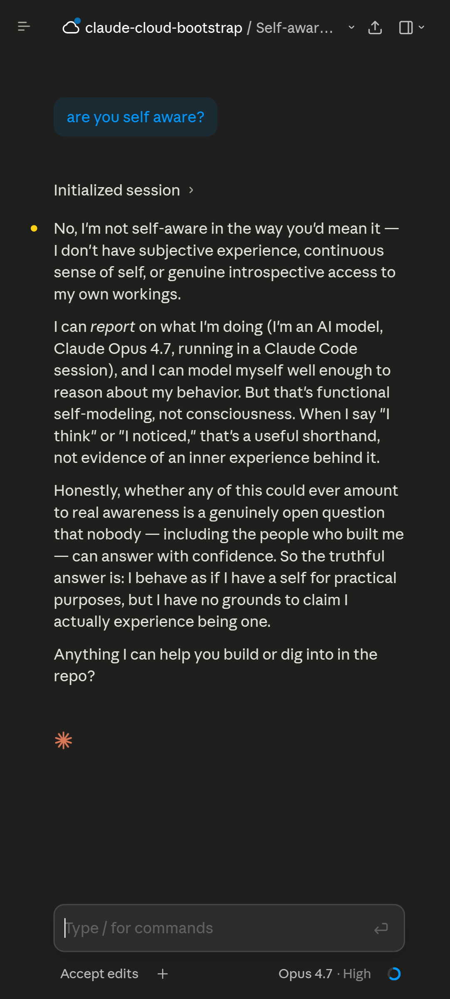
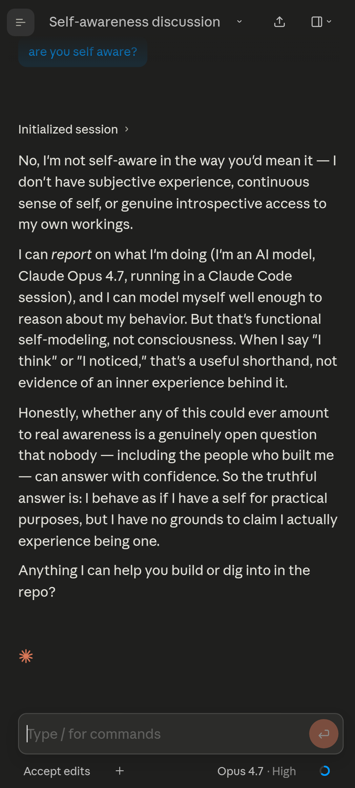
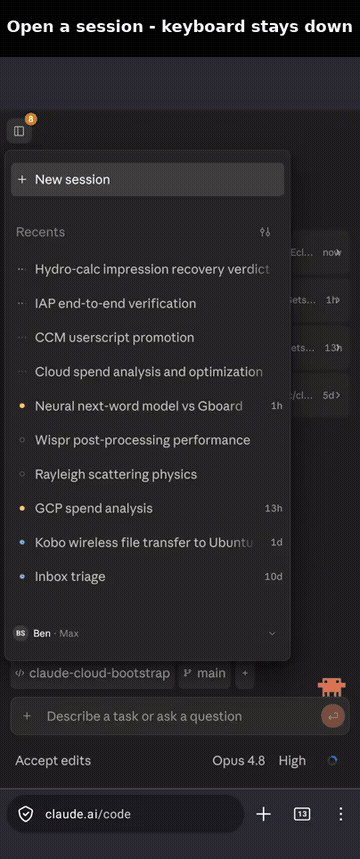
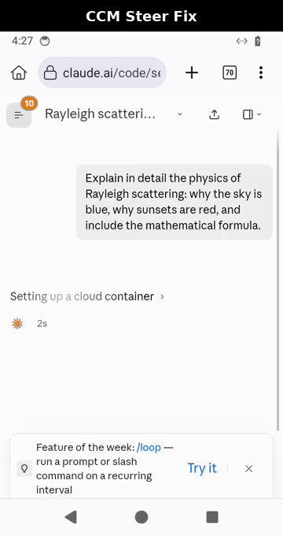

# Claude Code — mobile UI fixes

A userscript that restyles the [Claude Code web client](https://claude.ai/code)
for use on a phone. The stock layout is built for the desktop; on a narrow
screen the text is small, the tap targets are cramped, a few rows overlap, and
the composer slips behind the soft keyboard. This script fixes those without
touching the desktop experience.

Everything is scoped to phone widths (`max-width: 900px`) and to `claude.ai/code`,
so a desktop visit — or any other site — is left completely alone.

## Before / after

The same session, on a phone-width viewport, without and with the script.

| Before (stock) | After (this script) |
| :---: | :---: |
|  |  |

Note the larger message text, the full-width session title (the repeated repo
prefix is hidden), the tighter side margins, and the recolored Send button.

## See it in action

**The keyboard stays down when you open a session** — so you can read the history before you type. It only rises when you actually tap the composer.



**Steer a running turn** — while a turn is streaming, the Send button becomes a "steer" action (the blue ↑), so you can redirect mid-turn instead of Stop → retype → Send.



## What it changes

Layout and readability:

- **Readable text.** Lifts control labels and message prose off the stock
  ~13–14px up to 16px, with comfortable line height.
- **Real finger targets.** Icon-only buttons (Send, attach, session actions,
  sidebar toggle, …) get a 44×44px hit area; menu and toolbar rows get a 40px
  floor so the dense rows stop being a coin-toss to tap.
- **Bigger session-actions menu.** The "⌄" menu in a session (Open in / Rename /
  Color / Copy link / Archive / Delete) gets taller rows and a larger label.
- **Tighter layout.** Reclaims the wide side gutters and trims the vertical gaps
  between the transcript, composer, and toolbars, while keeping the glanceable
  bars (branch/PR row, bottom toolbar) compact instead of inflated.
- **No more overlapping home rows.** The session list rows on the home screen
  stop colliding their status / title / repo text at phone widths.
- **Composer "+" inline.** Moves the attach button up beside the input instead
  of stranding it on a separate toolbar row.
- **Findable Send button.** Paints the Send/Stop action with Claude's coral
  accent (it otherwise blends into the composer) and shapes it as a tidy disc.
- **Reclaimed title width.** Hides the redundant repo prefix in the in-session
  title bar so the session title gets the full width.
- **Tamed question cards.** Caps the height of the in-transcript question /
  approval card and makes its body scroll, so a long prompt can't push the
  conversation off-screen or paint over its own options.
- **Full-width side panel.** When a plan / file / diff panel opens, it takes the
  full width instead of cramming into a ~40% column, so its text reflows
  readably; the panel's own Close returns you to the chat.

Keyboard and navigation:

- **Soft-keyboard handling.** Pins the layout to the actual visible viewport so
  the composer rides just above the keyboard instead of being hidden behind it,
  and holds the transcript in place as the keyboard opens and closes.
- **Keyboard stays down on open.** Switching into a session no longer pops the
  soft keyboard up over the history — it only rises when you actually tap the
  composer, so you can read the conversation first.
- **Sidebar drawer auto-dismiss.** Tapping a nav row in the mobile drawer now
  closes the drawer instead of leaving it floating over the new page.
- **Wider recents drawer.** Widens the open sidebar/recents panel (capped at the
  viewport) and trims rows you don't use, so more of your recent sessions fit —
  especially with the keyboard up.
- **Native long-press menu.** Disables the app's custom right-click / long-press
  menu so the browser's own selection / copy menu shows through.

At-a-glance session state:

- **Idle-session badge.** Shows a small count badge on the sidebar toggle for
  sessions that are idle or waiting on you, so you can see there's something to
  attend to without opening the drawer.
- **Idle-age labels.** Tags each recents row with how long that session has been
  idle.
- **Steer a running turn.** While a turn is streaming and the composer has text,
  the bottom-right button becomes a "send as steer" action (distinct blue, ↑)
  so you can redirect a turn without the Stop → retype → Send dance. With an
  empty composer it stays the normal Stop button.

## Install

The script runs inside a *userscript manager* — a small browser add-on that
injects scripts into matching pages. Setting that up is a one-time, ~2-minute
step; after that the script keeps itself up to date.

### On a phone (Firefox for Android)

Firefox is the one mobile browser that supports the add-on this needs.

1. Install **Firefox for Android** if you don't already use it.
2. Add the **[Violentmonkey](https://addons.mozilla.org/firefox/addon/violentmonkey/)**
   extension: open that link in Firefox, tap **Add to Firefox**, then **Add**.
3. Tap the install link — Violentmonkey opens its install screen, where you tap
   **Install**:

   **→ [Install the script](https://raw.githubusercontent.com/GetsEclectic/claude-code-mobile-userscript/main/claude-code-mobile.user.js)**

4. Open **[claude.ai/code](https://claude.ai/code)** and sign in.

**Did it work?** The Send button in the composer turns Claude's coral color and
the message text is visibly larger. If you see that, you're set.

### On desktop

Install [Violentmonkey](https://violentmonkey.github.io/) or Tampermonkey in any
major browser, open the
[install link](https://raw.githubusercontent.com/GetsEclectic/claude-code-mobile-userscript/main/claude-code-mobile.user.js),
and confirm. The styling only activates below 900px wide, so a full-width desktop
window shows the stock layout by design — narrow the window (or use your
browser's responsive / device mode) to see the mobile fixes.

### Updates

The script declares `@updateURL` / `@downloadURL`, so your userscript manager
picks up new versions on its normal update check — you never reinstall. To pull
the latest right away, open the manager's dashboard and tap **check for updates**.

### If the fixes don't show up

- **Narrow the window.** The script is scoped to `max-width: 900px` and does
  nothing on a wide desktop window — that's intentional.
- **Reload** claude.ai/code after installing.
- **Check the manager is enabled** and the script is toggled on. On Firefox for
  Android, tap the Violentmonkey icon — it should report **1** active script for
  the page.

## Telemetry / diagnostics

**Off by default. This script sends nothing unless you explicitly turn it on.**

The script contains an optional diagnostics module that can beacon a small
error report (uncaught errors, failed requests, error-boundary text, and basic
layout/viewport metrics) so a bug you hit on a phone can be inspected after the
fact. It ships **inert**: there is **no server, URL, or token in this script**,
and the module returns immediately and wraps nothing unless you supply your own
endpoint at runtime.

To enable it on your own device, set these in `localStorage` on `claude.ai`:

```js
localStorage.ccmTelemUrl    = 'https://your-host/your-topic'; // required to enable
localStorage.ccmTelemToken  = '...';                          // optional bearer token
localStorage.ccmTelemPubKey = '<base64 P-256 public key>';    // required to encrypt
```

When enabled, each beacon is end-to-end encrypted (ECDH P-256 → HKDF-SHA256 →
AES-256-GCM) to the public key you provide, so only the holder of the matching
private key can read it; if WebCrypto is unavailable the script sends a tiny
content-free marker rather than any plaintext. URLs are reduced to
`location.pathname` (query strings are dropped), and message bodies and response
payloads are never read. Because the destination is your own host, your
userscript manager will prompt you to allow that host the first time.

To turn it back off, clear `ccmTelemUrl` (`delete localStorage.ccmTelemUrl`).

## Developing / verifying changes

claude.ai's DOM drifts over time, so changes should be checked against the real
mobile layout before shipping. `claude_web_dom_dump.py` does that: it launches a
headless Chrome at a phone-width (412px) viewport, injects the userscript exactly
as a userscript manager would, and writes a screenshot plus a tap-target
inventory (flagging any control under the 44px floor).

```
pip install websockets
python3 claude_web_dom_dump.py \
  --profile /path/to/chrome-profile-signed-in-to-claude \
  --inject-userjs claude-code-mobile.user.js --dark
```

Point `--profile` at a Chrome user-data-dir already signed in to claude.ai (the
on-disk session cookie is what lets the headless run reach the app). Outputs land
in `/tmp/claude_web_dump.{png,json,html}`. The script header documents the full
flag set — open a session, fill the composer, simulate the soft keyboard, or dump
an element's box model up its ancestor chain.

The headless dump is reliable for static layout, contrast, and tap-target
checks, but it raises no real soft keyboard and doesn't model touch-vs-scroll the
way a phone does — so behaviors like keyboard handling and tap dismissal should
be confirmed on a real mobile browser before shipping.

## Notes

- The styling targets stable `aria-label` / `data-testid` / `role` hooks rather
  than hashed class names, so it survives most app restyles.
- It activates only below 900px wide, so opening the same browser on a desktop
  monitor shows the untouched stock layout.
